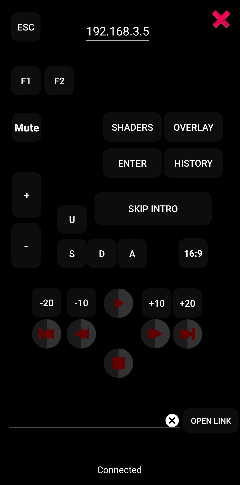
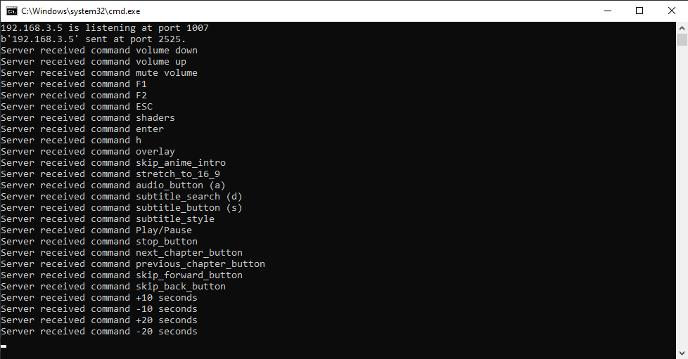

# OpenLink Server a CLI Python Program

## Introduction

This Python program acts as a backend for an Android app, serving as a remote controller using a local network connection. It listens for commands and links sent over the network and executes corresponding actions on the host machine.

## Features

- Receives commands and links over a TCP connection.
- Handles various commands to control media playback, volume, screen actions, etc.
- Opens links received in a new tab in the default browser.
- Utilizes UDP broadcasting for network discovery.

## Screenshots

Here are some screenshots showcasing the program in action:





## Prerequisites

- Python 3.x installed on the host machine.
- Compatible operating system (tested on Windows).

## Installation

1. **Clone the repository to your local machine:**

   ```bash
   git clone https://github.com/your-username/your-repository.git
   ```

2. **Navigate to the project directory:**

   ```bash
   cd your-repository
   ```

3. **Create a virtual environment:**

   ```bash
   python -m venv venv
   ```

4. **Activate the virtual environment (on Windows):**

   ```bash
   venv\Scripts\activate
   ```

5. **Install the required Python packages:**
   ```bash
   pip install -r requirements.txt
   ```

## Usage

1. **Run the program:**

   ```bash
   python cli_remote_controller.py
   ```

2. **Ensure that the host machine and the Android device are connected to the same local network.**

3. **Use the Android app to send commands or links to the host machine's IP address.**

## Commands

- **Volume Control**:

  - `volume down`: Decrease the volume.
  - `volume up`: Increase the volume.
  - `alt+m`: Mute the volume.

- **Playback Control**:

  - `left arrow`: Skip backward by 10 seconds.
  - `right arrow`: Skip forward by 10 seconds.
  - `alt+left arrow`: Skip backward by 20 seconds.
  - `alt+right arrow`: Skip forward by 20 seconds.
  - `space`: Play/Pause.
  - `s`: Toggle subtitles.
  - `d`: Search subtitles.
  - `a`: Toggle audio.
  - `;`: Stop playback.
  - `page down`: Next chapter.
  - `page up`: Previous chapter.
  - `ctrl+page down`: Skip forward.
  - `ctrl+page up`: Skip backward.
  - `history`: View history.

- **Other Commands**:
  - `turn_off_screen`: Turn off the screen.
  - `skip_anime_intro`: Skip anime intro.
  - `16_9`: Stretch video to 16:9 aspect ratio.

## Contributing

Contributions are welcome! Feel free to open issues or submit pull requests to enhance the functionality of the program.

## License

This project is licensed under the MIT License - see the [LICENSE](LICENSE) file for details.

## Acknowledgments

- Special thanks to [pyKey](https://pypi.org/project/pyKey/) for providing keyboard handling functionalities.
- Inspired by the need for a simple remote control solution for media playback.
